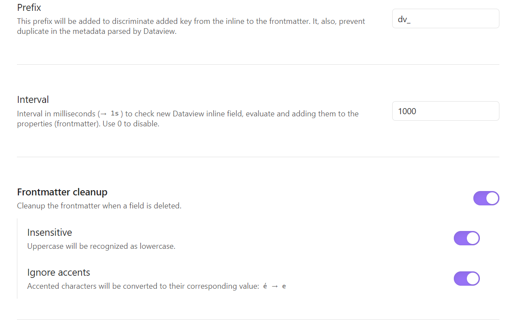
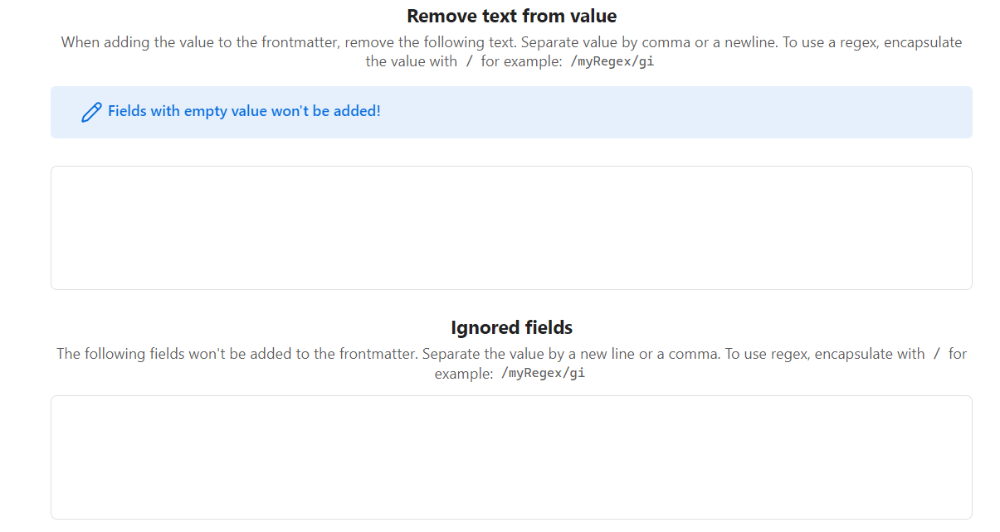
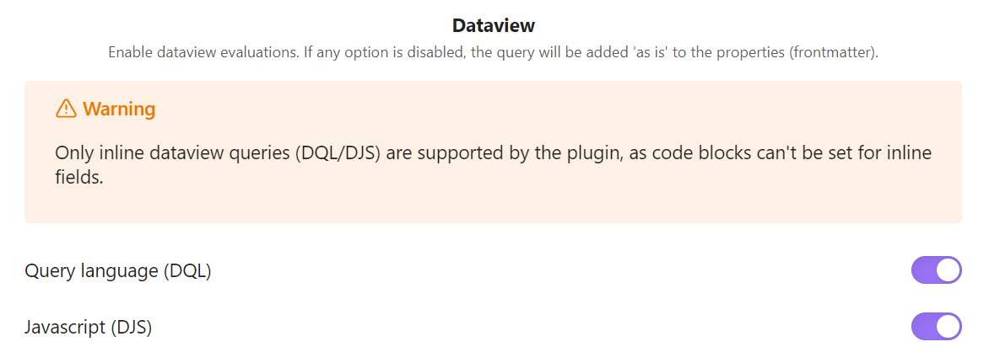

# Dataview (to) Properties

Dataview Properties allows you to automatically copy Dataview inline fields (and their values, even calculated ones!) into frontmatter properties and keep them synchronized.

## ✨ Features
The plugin offers the following features:

- Conversion of Dataview queries (DQL and DataviewJS) to frontmatter
- Support for both block and inline queries
- Automatic synchronization based on a configurable interval
- Dedicated command to manually trigger synchronization
- Evaluation of calculated values before insertion into frontmatter
- Automatic cleanup of the frontmatter when the Dataview field is removed (optional)
- Lowercase & ignore accents for values and fields recognition
- Granular options to convert to properties list. 

> [!WARNING]
> The Dataview plugin must be installed and activated in your Obsidian vault.

## ⚙️ Configuration




> [!TIP]
> Both options (frontmatter cleanup, ignore and text removing) supports **insensitive** and **ignore accent** recognition:
> - **Insensitive** : The plugin will ignore the case of the field names when checking for matches. For example, if you have a field named "Name" and you set "name", both value will be recognized as the same.
> - **Ignore accent** : The accented characters will be converted to their non-accented counterparts. For example, if you have a field named "école" and you set "ecole", both value will be recognized as the same.

- **Prefix**: The prefix to add to the frontmatter properties. This is useful to avoid conflicts with existing properties (and Dataview metadata). The default value is `dv_`. **An empty prefix is not supported.**
- **Interval**: The time interval (in milliseconds) at which the plugin will check for changes in the Dataview queries and update the frontmatter properties accordingly. The default value is 1000ms (1 second).
- **Mark a field as a list**: A textarea to define fields that must be converted to a list. Separate the fields with a comma or a new line. To use regex, encapsulate with `/` (ex: `/^name$/i`).
- **Frontmatter cleanup** : Automatically remove the frontmatter properties when the corresponding Dataview field is removed. Enabled by default.
- **Ignored fields** : A list (of string) of fields to ignore (aka that won't be copied). Separate the fields with a comma or a new line. To use regex, encapsulate with `/` (ex: `/^name$/i`). 
- **Text removing** : Remove pattern or value from the field **value** when adding it to the frontmatter. Useful to remove some unwanted characters like `%%`. Like **ignored fields**, you can use regex by encapsulating the pattern with `/` (ex: `/^name$/i`).
- **Dataview** : Enable/disable the evaluation of each type of dataview query. Only inline queries are supported.
    - **Dataview Query Language (DQL)**
    - **DataviewJS**

> [!CAUTION]
> Only string/numbers/date are supported in the frontmatter. When the evaluated queries returns a html, it will converted to markdown. 

## 🛠️ Usage

> [!TIP]
> The keys are copied into the frontmatter with a prefix (that you can configure) to avoid conflicts with existing properties (and Dataview metadata). 
> The default prefix is `dv_`. 
> **An empty prefix is not supported.**

### Automatic synchronization

By default, the plugin automatically synchronizes the Dataview queries within the frontmatter (proprieties) when the metadata are changed. This synchronization is triggered based on the configured interval (default: `1000ms`).

### Manual command

You can also trigger the synchronization manually by using the command palette (<kbd>Ctrl</kbd>+<kbd>P</kbd> | <kbd>Cmd</kbd> + <kbd>P</kbd>) and searching for "Dataview Properties : Add the Dataview field to the frontmatter". This will force the plugin to check for changes in the Dataview queries and update the frontmatter properties accordingly.

> [!TIP]
> For a file containing:
> ```markdown
> ---
> name: "name"
> force: 12
> agility: 5
> ---
>
> # Hello world
> Vitality:: `$= this.force + this.agility`
> ```
> The plugin will update the file accordingly:
> ```markdown
> ---
> name: "name"
> force: 12
> agility: 5
> dv_Vitality: 17
> ---
>
> # Hello world
> Vitality:: `$= this.force + this.agility`
> ```

The plugin also works with more complex queries, like links (and they will be converted to markdown links as `[[mylinks]]`), date or numbers.

> [!CAUTION]
> - Widget and function won't be added to the frontmatter.
> - HTML will be converted to markdown.

## 📥 Installation

- [ ] From Obsidian's community plugins
- [x] Using BRAT with `https://github.com/Mara-Li/obsidian-dataview-properties`
- [x] From the release page: 
    - Download the latest release
    - Unzip `dataview-properties.zip` in `.obsidian/plugins/` path
    - In Obsidian settings, reload the plugin
    - Enable the plugin


### 🎼 Languages

- [x] English
- [x] French

To add a translation:
1. Fork the repository
2. Add the translation in the [`src/i18n/locales`](./src/i18n/locales) folder with the name of the language (ex: `fr.json`). 
    - You can get your locale language from Obsidian using [obsidian translation](https://github.com/obsidianmd/obsidian-translations) or using the commands (in templater for example) : `<% tp.obsidian.moment.locale() %>`
    - Copy the content of the [`en.json`](./src/i18n/locales/en.json) file in the new file
    - Translate the content
3. Edit `i18n/i18next.ts` :
    - Add `import * as <lang> from "./locales/<lang>.json";`
    - Edit the `ressource` part with adding : `<lang> : {translation: <lang>}`

---
## Special thanks & credits

- [Jesse Hines for wdio obsidian service](https://github.com/jesse-r-s-hines/wdio-obsidian-service) that *finally* made me able to test the plugin in a real obsidian environment automatically. It mean a lot for a QA tester like me!
- [Obsidian Dataview](https://github.com/blacksmithgu/obsidian-dataview) as a dependecies.
- [Obsidian Digital Garden](https://github.com/oleeskild/obsidian-digital-garden) for the first version of the Dataview compiler/evaluator.
